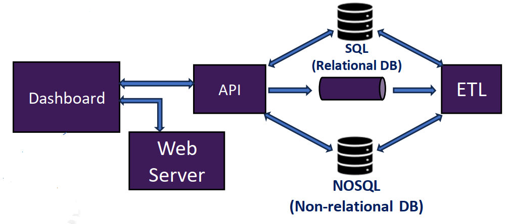

# premo-dashboard-public

This is the public repo for PREMO dashboard.
This project allows the visualization of COVID-19 infected patients data while they were in the ICU, for project PREMO.

This allows graphical representation with circular/bar charts, scatter plots and boxplots for cross-sectional data. Regarding longitudinal data, it has the Kaplan Meier survival curves and scatter lines. Also allows import and export data, and user management.

This work was done in the context of the project __Predictive Models of COVID-19 Outcomes for Higher Risk Patients Towards a Precision Medicine (PREMO)__, supported by _Fundação para a Ciência e Tecnologia (FCT)_, under the grant DSAIPA/DS/0117/2020.

[https://www.isel.pt/investigacao-e-inovacao/ecossistema-de-inovacao/projetos/2020/premo](https://www.isel.pt/investigacao-e-inovacao/ecossistema-de-inovacao/projetos/2020/premo)

# How to run
This application use docker containers to run the various services, thus it's required to have Docker installed.

There are several .env files that are used by the applications running on containers. These files contain the environmental variables for the different services that are used to indicate usernames, password or URLs.

All of these present dummy values, but should work. The only exception is the variable "PREMO_DB_CS", located in [this](/Logic/Api/.env) .env file. This variable represents the connection string for the relational database and must be changed.

To run docker, run [this](/docker/docker-up.bat) .bat file for Windows. It will run docker-compose, create the images and run the containers.

# Architecture
The project consists of the following services, as shown in the figure:
* __Dashboard__, which is the UI provided to the user; 
* __Web Server__, which provides the dashboard to the user;
* __API__, works as the logic part of a three-tier architecture. Uses the relational DB to provide the requested data to the user in the UI;
* __SQL__, is a relational DB that holds the persistent data;
* __NOSQL__, is a non-relational DB used by the API to send files to the ETL service;
* __Message Queue__, used by the API to indicate the ETL service which files to process;
* __ETL__, the ETL service. Receives the file indications from the message queue, gets these files from the non-relational, processes them and stores in the relational DB.

